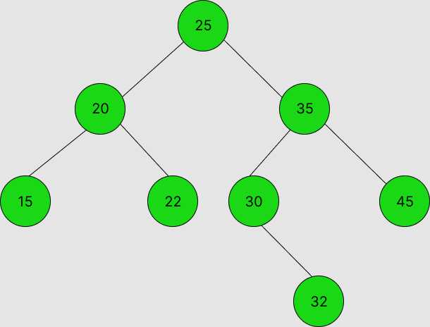

Given a Binary Search Tree with unique node values and a target value. You have to find the node whose data is equal to target and return the sum of all descendant node's data which are vertically below the target node. Initially, you are at the root node.

**Note:** If target node is not present in bst then return -1.

**Example 1:**

~~~
Input:
Target = 35

Output: 32

Explanation: Vertically below 35 is 32.
~~~

**Example 2:**

~~~
Input:
Target = 25

Output: 52

Explanation: Vertically below 25 is 22, 30 and their sum is 52.
~~~

**Your Task:**

You don't need to read input or print anything. Your task is to complete the function verticallyDownBST() which takes BST(you are given root node of bst ) and target as input, and return an interger value as the sum of vertically down nodes from target. If target is not present in bst then return -1.

**Expected Time Complexity:** O( n ), n is number of nodes.

**Expected Auxiliary Space:** O(Height of the tree).

**Constraints:**
 - 1 <= n < 106
 - 1 <= target <= n
 - 1 <= node.data < 106
