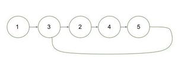

Given a singly linked list of N nodes. Find the first node of the loop if the linked list has a loop. If a loop is present return the node data of the first node of the loop else return -1.

**Example 1:**

~~~
Input:
~~~

~~~
Output: 3

Explanation:
We can see that there exists a loop
in the given linked list and the first
node of the loop is 3.
~~~

**Example 2:**

~~~
Input:
~~~

~~~
Output: -1

Explanation: No loop exists in the above
linked list.So the output is -1.
~~~

**Your Task:**

The task is to complete the function findFirstNode() which contains reference to the head as only argument. This function should return the value of the first node of the loop if the linked list contains a loop, else return -1.

**Expected Time Complexity:** O(N)

**Expected Auxiliary Space:** O(1)

**Constraints:**

1 <= N <= 105
1 <= Data on Node <= 106
0 <= pos <= N
