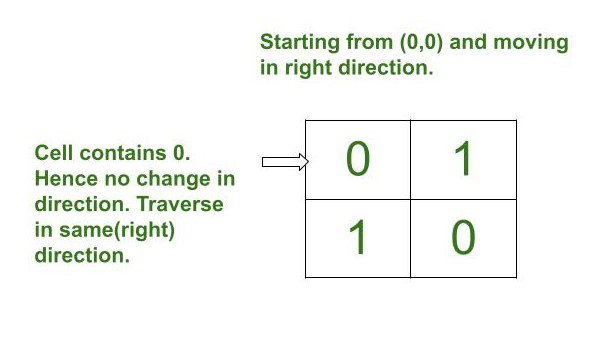
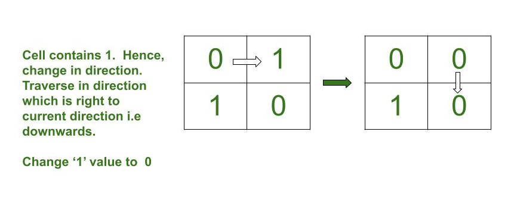
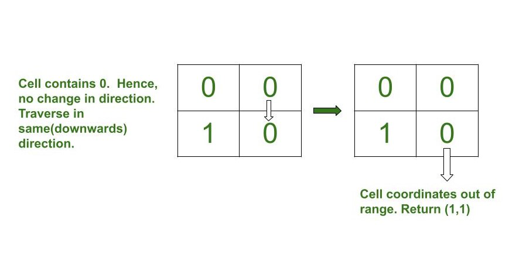

Given a binary matrix of dimensions  with R rows and C columns. Start from cell(0, 0), moving in the right direction. Perform the following operations:

If the value of matrix[i][j] is 0, then traverse in the same direction and check the next value.

If the value of matrix[i][j] is 1, then update matrix[i][j] to 0 and change the current direction clockwise. ie - up, right, down, or left directions change to right, down, left, and up respectively.

Find the index of the cell where you will be forced to exit the matrix while performing the given traversal.

**Example 1:**

~~~
Input:
matrix[][] = {{0,1}, {1,0}}
R=2
C=2

Output: (1,1)

Explanation:

~~~

**Example 2:**

~~~
Input:
matrix[][] = {{0, 1, 1, 1, 0}, {1, 0, 1, 0, 1}, {1, 1, 1, 0, 0}}
R=4
C=4

Output: (2,0)

Explanation: We will leave the grid after visiting the index (2,0).
~~~

**Your Task:**

You don't need to read input or print anything. Complete the function endPoints() which take  a 2D matrix[][] , an integer R and an integer C as  input parameter and returns the index of the last cell before exiting the matrix.

**Expected Time Complexity:** O(N)

**Expected Space Complexity:** O(1)

**Constrains:**
 - 1<= R,C<=1000
 - 0<= matrix[i][j] <=1

